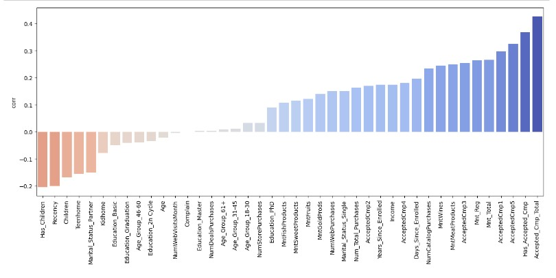
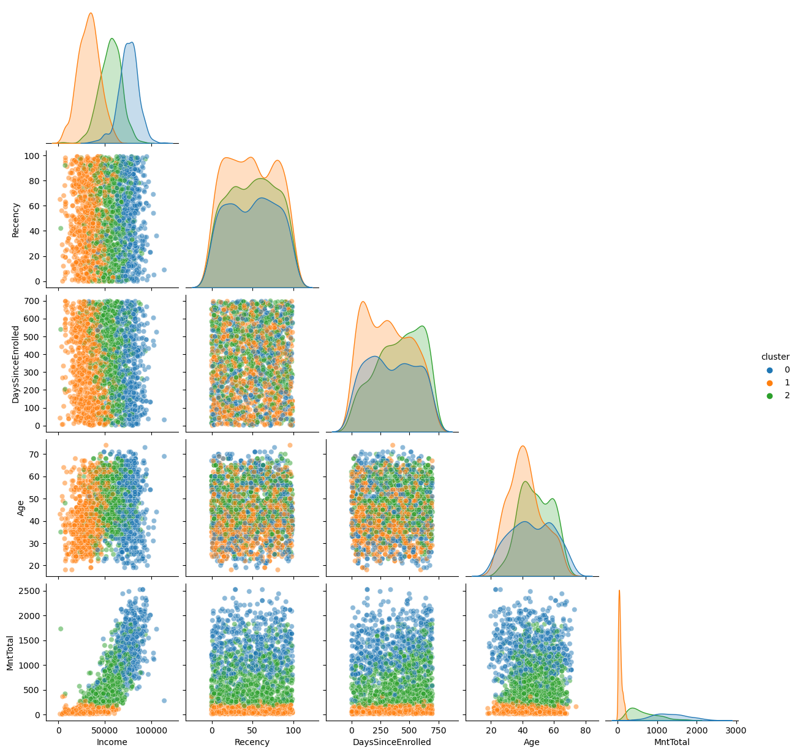

# Case Ifood
This repository was made to explain the project of **[Github Ifood](https://github.com/ifood/ifood-data-business-analyst-test)**:

**The comments in the codes are in PT-BR**.
## Objectives:
- The objective of the team is to build a predictive model that will produce the highest profit for the 
next direct marketing campaign, scheduled for the next month. The new campaign, sixth, aims at 
selling a new gadget to the Customer Database. To build the model, a pilot campaign involving 2.240 
customers was carried out. The customers were selected at random and contacted by phone 
regarding the acquisition of the gadget. During the following months, customers who bought the 
offer were properly labeled.

 

## Main libraries used:
- Pandas, Numpy, Matplotlib, Sklearn, Seaborn, Imblearn.
## Original dataset of the project
- [ml_project1_data.csv](https://github.com/BrunoFelipeCB/Case-Ifood/blob/main/data/ml_project1_data.csv)
## You can find me at:
&nbsp;&nbsp;
## [Step 1: EDA.ipynb](https://github.com/BrunoFelipeCB/Case-Ifood/blob/main/notebooks/01-%20EDA.ipynb)
- In the first notebook, I imported the original dataset and performed checks to assess the data integrity.
- I imported the [ydata_profiling](https://github.com/ydataai/ydata-profiling) library to assist me in conducting analyses, generating a [report](https://github.com/BrunoFelipeCB/Case-Ifood/tree/main/report).
- I adjusted the date column.
- I created columns that could bring more information to the business.
- Checking outliers in the columns I deemed important.
- Creating the [Auxiliary Functions](https://github.com/BrunoFelipeCB/Case-Ifood/blob/main/notebooks/Auxiliary_functions.py) file and with its help, I started the process of deleting rows.
- Deleting columns that didn't provide much information.
- Plotting some pairplots for analysis.
- Using the Dummies function to improve the visualization of correlations.
- With the 'Response' column, checking the correlation between the other columns and plotting it in the graph below.

## [Step 2: Clustering](https://github.com/BrunoFelipeCB/Case-Ifood/blob/main/notebooks/02-%20Clustering.ipynb)
- Imported the dataset with the new features and dropped columns.
- Graphically examining the behavior of numeric columns.
- Separating columns for each type of preprocessing.
- Graphically checking the behavior of columns after preprocessing (excluding those that underwent OneHotEncoder because graphically they would only have 0 and 1).
- From the Auxiliary_functions file, brought in Elbow and Silhouette Method graphs to assist in choosing the number of clusters.
- Creating the pipeline and performing clustering.
- Graphically examining the behavior of clusters in relation to some columns, as shown in the graph below.

## [Step 3: Clustering_PCA](https://github.com/BrunoFelipeCB/Case-Ifood/blob/main/notebooks/03-%20Clustering_PCA.ipynb)
- For PCA, I imported the same dataset with the new features and dropped columns.
- Separating the columns for each type of preprocessing.
- From the Auxiliary_functions file, brought in Elbow and Silhouette Method graphs to assist in choosing the number of clusters.
- Creating the pipeline and performing clustering, now with PCA, limiting the components to 2 to visualize the clusters in 2D.
- Labeling the clusters (the labels will be in Step 6).
- Graphically showing the centroids.
- Demonstrating the separation of clusters, as shown in the graph below.

## [Step 4: Classification.](https://github.com/BrunoFelipeCB/Case-Ifood/blob/main/notebooks/04-%20Classification.ipynb)
- Importing the pre-clustered dataset.
- Splitting the dataset for training.
- -Separating the columns for each type of preprocessing, adding the 'cluster' column, and removing the 'Response' column.
- Utilizing three libraries commonly used in classification models, and employing the DummyClassifier library as a benchmark; any model with worse performance than it will be discarded.
- Creating the results dictionary for later creation of a dataframe and model comparisons.
- Generating a graph of the metrics used (see graph below) and selecting Logistic Regression as the model to be fine-tuned with hyperparameters.
- 
## [Step 5: Classification_logreg.](https://github.com/BrunoFelipeCB/Case-Ifood/blob/main/notebooks/05-%20Classification_logreg.ipynb)
- Importing the pre-clustered dataset.
- Splitting the dataset for training.
- Separating the columns for each type of preprocessing, adding the 'cluster' column, and removing the 'Response' column.
- Using only the Logistic Regression model, still without hyperparameters, to graphically visualize the ROC curve and Precision-Recall curve.
- Tuning hyperparameters with the GridSearchCV library.
- Checking the best hyperparameters for the model.
- Graphically displaying information for each metric.
- Creating another pipeline, now incorporating the found hyperparameters.
- Assessing the importance of each column for labeling a customer, with negative importance indicating the most significant factors for a negative response to the marketing campaign and positive importance indicating the most significant factors for a positive response to the marketing campaign.
- Visualizing the ROC curve and Precision-Recall curve graphically.
## Step 6: Considerations and results.

- With the pipeline performing preprocessing, PCA, K-Means, GridSearchCV, LogisticRegression, RandomUnderSampler, KNeighborsClassifier, DecisionTreeClassifier, among others, the dataset was segmented into 3 clusters.

**Cluster 0**:

- Intermediate income
- Intermediate spending
- Likely to have children
- Likely to accept campaigns
- Older age group

**Cluster 1**:

- Low income
- Low spending
- Likely to have children
- Low likelihood to accept campaigns
- Only cluster with a significant percentage of individuals with basic education
- Younger age group

**Cluster 2**:

- High income
- High spending
- Very likely to not have children
- More inclined to accept campaigns
- Cluster without individuals with basic education
- No distinctive age profile

#### Translating the points above into a table:
Has_Children | Income | Age | Education | Accepted_Cmp_Total | Mnt_Total | Cluster
--- | --- | --- | --- | --- | --- | ---
High | Moderate | High | Moderate | Moderate | Moderate | 0 
High | Low | Low | Low | Low | Low | 1
Low | High | Moderate | High | High | High | 2

