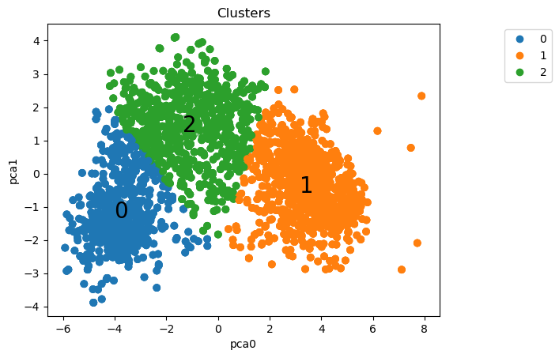

# Case Ifood
This repository was made to explain the project of **[Github Ifood](https://github.com/ifood/ifood-data-business-analyst-test)**:

**The comments in the codes are in PT-BR**.
## Objectives:
- The objective of the team is to build a predictive model that will produce the highest profit for the 
next direct marketing campaign, scheduled for the next month. The new campaign, sixth, aims at 
selling a new gadget to the Customer Database. To build the model, a pilot campaign involving 2.240 
customers was carried out. The customers were selected at random and contacted by phone 
regarding the acquisition of the gadget. During the following months, customers who bought the 
offer were properly labeled.

 

## Main libraries used:
- Pandas, Numpy, Matplotlib, Sklearn, Seaborn, Imblearn.
## Original dataset of the project
- [ml_project1_data.csv](https://github.com/BrunoFelipeCB/Case-Ifood/blob/main/data/ml_project1_data.csv)
## You can find me at:
&nbsp;&nbsp;
## [Step 1: EDA.ipynb](https://github.com/BrunoFelipeCB/Case-Ifood/blob/main/notebooks/01-%20EDA.ipynb)
- In the first notebook, I imported the original dataset and performed checks to assess the data integrity.
- I imported the [ydata_profiling](https://github.com/ydataai/ydata-profiling) library to assist me in conducting analyses, generating a [report](https://github.com/BrunoFelipeCB/Case-Ifood/tree/main/report).
- I adjusted the date column.
- I created columns that could bring more information to the business.
- Checking outliers in the columns I deemed important.
- Creating the [Auxiliary Functions](https://github.com/BrunoFelipeCB/Case-Ifood/blob/main/notebooks/Auxiliary_functions.py) file and with its help, I started the process of deleting rows.
- Deleting columns that didn't provide much information.
- Plotting some pairplots for analysis.
- Using the Dummies function to improve the visualization of correlations.
- With the 'Response' column, checking the correlation between the other columns and plotting it in the graph below.

## [Step 2: Clustering](https://github.com/BrunoFelipeCB/Case-Ifood/blob/main/notebooks/02-%20Clustering.ipynb)
- Imported the dataset with the new features and dropped columns.
- Graphically examining the behavior of numeric columns.
- Separating columns for each type of preprocessing.
- Graphically checking the behavior of columns after preprocessing (excluding those that underwent OneHotEncoder because graphically they would only have 0 and 1).
- From the Auxiliary_functions file, brought in Elbow and Silhouette Method graphs to assist in choosing the number of clusters.
- Creating the pipeline and performing clustering.
- Graphically examining the behavior of clusters in relation to some columns, as shown in the graph below.

## [Step 3: Clustering_PCA](https://github.com/BrunoFelipeCB/Case-Ifood/blob/main/notebooks/03-%20Clustering_PCA.ipynb)

## [Step 4: Classification.](https://github.com/BrunoFelipeCB/Case-Ifood/blob/main/notebooks/04-%20Classification.ipynb)

## [Step 5: Classification_logreg.](https://github.com/BrunoFelipeCB/Case-Ifood/blob/main/notebooks/05-%20Classification_logreg.ipynb)

## Step 6: Considerations and results.

- With the pipeline performing preprocessing, PCA, and K-Means, the dataset was segmented into 4 clusters, as shown in the figures below:

- Cluster 0 consists of older individuals with intermediate salaries and scores.
- Cluster 1 consists of younger individuals with intermediate salaries and higher scores.
- Cluster 2 consists of wealthier individuals with lower scores.
- Cluster 3 consists of middle-aged individuals with high salaries and high scores.

#### Translating the points above into a table:

| Spending Score (1-100) | Annual Income (k$)    | Age      | Cluster |
| -----------------------| --------------------- | -------- | ------- |
| Moderate               | Moderate              | High     | 0       |
| High                   | Moderate              | Young    | 1       |
| Low                    | High                  | Moderate | 2       |
| High                   | High                  | Moderate | 3       |

